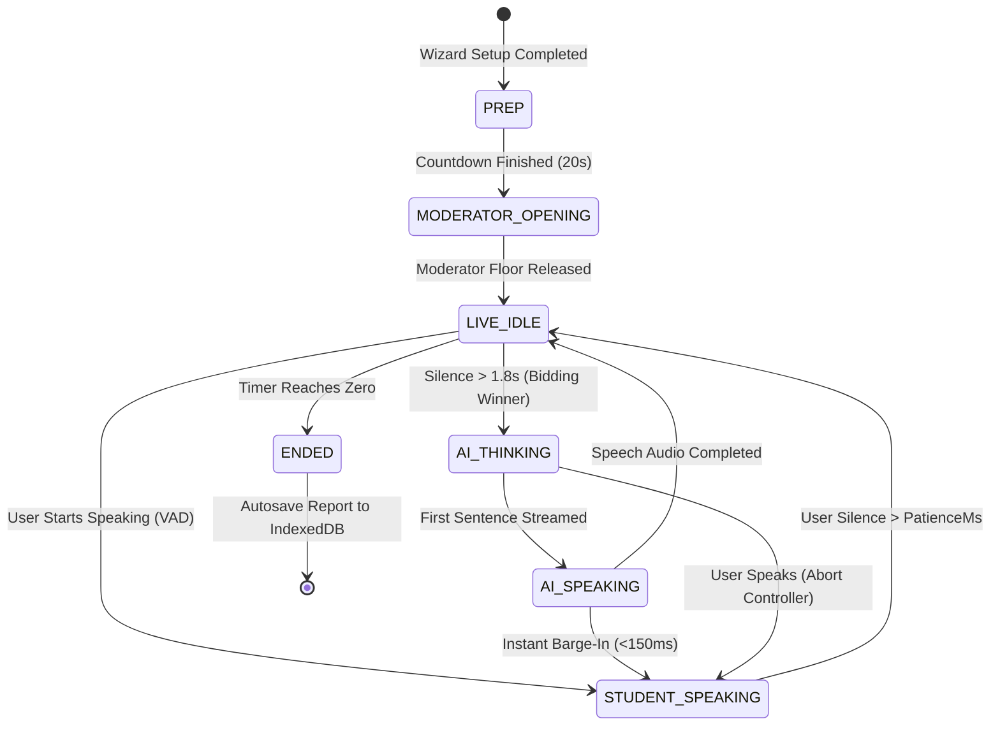

# PANELPREP — Judge Q&A, Technical Architecture & Pitch Defense Guide

> **Project:** PANELPREP — Voice-First AI Placement Group Discussion Simulator  
> **Target Audience:** Ideathon / Hackathon Judges, Technical Evaluators, Placement Directors, & AI Engineers.

---

## Table of Contents
1. [Core Pitch & Product Vision](#1-core-pitch--product-vision)
2. [Claim vs. Reality: Why Normal Chatbots Fail at GDs](#2-claim-vs-reality-why-normal-chatbots-fail-at-gds)
3. [Multi-Agent Orchestration: How Multiple AIs Respond Without Chaos](#3-multi-agent-orchestration-how-multiple-ais-respond-without-chaos)
4. [Floor Bidding Engine & Turn Taking](#4-floor-bidding-engine--turn-taking)
5. [Audio Pipeline: STT, TTS & Instant Barge-In (<150ms)](#5-audio-pipeline-stt-tts--instant-barge-in-150ms)
6. [Voice Isolation, Echo Suppression & Audio Engineering](#6-voice-isolation-echo-suppression--audio-engineering)
7. [Context Management & Memory Architecture](#7-context-management--memory-architecture)
8. [Evidence Verification & Zero-Hallucination Rubrics](#8-evidence-verification--zero-hallucination-rubrics)
9. [Edge Cases Encountered, Fixes & Architectural Decisions](#9-edge-cases-encountered-fixes--architectural-decisions)
10. [Cost, Scalability & Competitive Moat](#10-cost-scalability--competitive-moat)

---

## 1. Core Pitch & Product Vision

### Q: What is PanelPrep in one sentence?
**Answer:**  
PanelPrep is an ultra-low latency, voice-first AI Group Discussion simulator that places job candidates in a realistic, multi-persona boardroom debate with instant `<150ms` barge-in capability and 100% verified evidence-backed placement scoring.

### Q: What exact problem are you solving?
**Answer:**  
Campus placement GD rounds filter out **over 60% to 70% of candidates** before technical or HR interviews. Students fail not because of lack of technical knowledge, but due to:
1. **Pacing and Floor Contention:** Hesitating during 1-second silence windows.
2. **Handling Aggressive Interruptions:** Freezing when a peer cuts them off.
3. **Synthesis vs. Dominance:** Speaking too much without building on others' ideas.

Practicing with human peers is scheduling-heavy, unstructured, and lacks objective feedback. Normal AI tools (like ChatGPT voice mode) are strictly 1-on-1 and cannot simulate a dynamic, multi-person competitive boardroom.

---

## 2. Claim vs. Reality: Why Normal Chatbots Fail at GDs

| Dimension | Generic AI / ChatGPT Voice Mode | PanelPrep Engine |
| :--- | :--- | :--- |
| **Conversational Dynamic** | Strict 1-on-1 sequential ping-pong. | Multi-party conference room with 3 to 5 distinct personas + 1 Moderator. |
| **Turn Taking & Interruption** | Waits for user to finish completely before answering. | Instant `<150ms` client-side barge-in; candidate can interrupt AI mid-sentence. |
| **Floor State Control** | Single stateless conversation. | Explicit Finite State Machine (`LIVE_IDLE`, `STUDENT_SPEAKING`, `AI_SPEAKING`, `AI_THINKING`, `MODERATOR_OPENING`). |
| **AI Personalities** | Uniform, helpful, assistant-like tone. | Engineered behavioral archetypes (Dominator, Analyst, Interrupter, Synthesizer, Grounder). |
| **Evaluation Feedback** | Generic text advice ("You did well, speak more clearly"). | Deterministic telemetry (WPM, talk share %, filler words) + Verified exact quote IDs from the transcript. |

---

## 3. Multi-Agent Orchestration: How Multiple AIs Respond Without Chaos

### Q: How do 5 AI participants interact without speaking over each other?
**Answer:**  
We do not run 5 parallel unconstrained LLM loops. Instead, PanelPrep uses a **Centralized Floor State Machine + Stochastic Bidding Engine**:
1. Only **one entity** holds the conversational floor token at any millisecond.
2. When the floor becomes `LIVE_IDLE` (silence exceeds 1.8s), all active AI personas calculate a **bid score** based on their archetype parameters.
3. The highest bidder wins the turn token and begins streaming speech.
4. If the human student starts speaking at any moment, the client-side Voice Activity Detector immediately strips the floor token from the AI and awards it to the candidate in `<150ms`.

---

## 4. Floor Bidding Engine & Turn Taking

### Q: What is the exact formula for determining which AI speaks next?
**Answer:**  
The bidding score $B_i$ for persona $i$ is calculated deterministically on the client using:

$$B_i = (W_{\text{talk}} \times R) \times D_{\text{recency}} \times M_{\text{student}} + \epsilon$$

Where:
- **$W_{\text{talk}}$ (Talkativeness Weight):** Persona-specific baseline (Arjun = 1.8, Kabir = 1.5, Meera = 1.2, Sana = 1.0, Rohan = 0.9).
- **$R$ (Random Variance):** Uniform distribution $[0.8, 1.2]$ to prevent deterministic turn loops.
- **$D_{\text{recency}}$ (Recency Decay Penalty):** Exponential penalty ($0.15^{\text{turns\_ago}}$) if persona spoke in the last 2 turns, preventing one AI from monopolizing the conversation.
- **$M_{\text{student}}$ (Student Invite Multiplier):** If the candidate has been silent for $>45\text{s}$, Sana or Dr. Nair's bid multiplier spikes ($2.5\times$) with an `invite_student` intent.
- **$\epsilon$ (Consecutive AI Dampener):** If AI has spoken 3 consecutive times, all AI bids decay by $60\%$ to force conversational dead-air for the student to take the floor.

---

## 5. Audio Pipeline: STT, TTS & Instant Barge-In (<150ms)

### Q: How do you achieve `<150ms` barge-in without expensive proprietary server hardware?
**Answer:**  
Barge-in latency in traditional voice pipelines is slow ($>800\text{ms}$) because audio is sent over WebSockets to a server before the server cancels TTS.

**PanelPrep solves this by running Voice Activity Detection (VAD) entirely on the client:**
1. **Web Audio API AnalyserNode** monitors local microphone input in the browser at 60 FPS.
2. The instant user volume exceeds the calibrated RMS energy threshold (`0.08`), the client executes three immediate synchronous operations:
   - `window.speechSynthesis.cancel()` (kills current speaker audio in `~5ms`).
   - `activeAbortController.abort()` (aborts streaming LLM token generation immediately).
   - Marks the interrupted AI segment with `interrupted: true` in the active transcript.
3. Floor state switches to `STUDENT_SPEAKING` before the first speech-to-text token is even finalized.

---

## 6. Voice Isolation, Echo Suppression & Audio Engineering

### Q: How do you prevent the AI's own audio coming from the speakers from being transcribed as user speech?
**Answer:**  
We employ a three-tier echo suppression strategy:
1. **Hardware / Browser AEC:** Native browser WebRTC constraints `echoCancellation: true`, `noiseSuppression: true`, and `autoGainControl: true`.
2. **Floor Gating:** Audio input is actively ignored during the `MODERATOR_OPENING` buffer unless the user speaks at a significantly higher energy threshold.
3. **Lexical Echo Filter (`isEchoOfCurrentAiSpeech`):** If Web Speech STT transcribes a phrase during `AI_SPEAKING`, it is passed through a Levenshtein and token overlap comparison against `activeAiSentence`. If similarity is $>70\%$, the transcript is silently discarded as speaker bleed-through.

---

## 7. Context Management & Memory Architecture

### Q: How do you feed context to the LLM without exceeding rate limits or tokens?
**Answer:**  
Each turn request (`/api/turn`) receives a structured, compressed payload containing:
1. **System Prompt with Intent:** Injects persona archetype + active turn intent (`challenge`, `bring_example`, `redirect`, `summarise`).
2. **Sliding Window Transcript:** Only the **last 8 to 10 conversational turns** are passed inside `<transcript>` tags, preserving recent conversational flow while maintaining a token budget of `<400 tokens`.
3. **Self-Repetition Avoidance (`own_recent`):** The last 2 utterances spoken by this specific persona are injected into the prompt with a negative instruction: *"Do not repeat your earlier points"*.
4. **Output Constraint:** Model is strictly instructed: *"1 to 3 short sentences, maximum 40 words, spoken conversational English, no markdown"*.

---

## 8. Evidence Verification & Zero-Hallucination Rubrics

### Q: How can you guarantee the feedback report doesn't hallucinate quotes?
**Answer:**  
Most AI coaching tools hallucinate praise like *"You made a great point about renewable energy"* even if the user never said it.

**PanelPrep implements a Dual-Layer Verification Engine:**
1. **Deterministic Telemetry (100% Math, 0% LLM):**
   - Speaking Pace (WPM) = $\frac{\text{Total User Words}}{\text{User Speaking Time (Min)}}$
   - Talk Share $\%$ = $\frac{\text{User Speaking Milliseconds}}{\text{Total Room Milliseconds}} \times 100$
   - Filler Word Density = Exact regex matching on `\b(um|uh|like|basically|matlab|toh)\b`
   - Interruption Count = Direct count of floor state preemptions.
2. **AST Transcript Segment Matcher (`evidenceValidator.ts`):**
   - Every segment in the session is assigned an immutable ID (e.g., `u_001`, `u_002`).
   - When the LLM generates rubric evaluation, every piece of evidence must supply `quote` and `segment_id`.
   - The server validates that `quote` is an exact substring match within the specified segment ID. If the quote does not exist or was altered by the LLM, the claim is rejected and stripped from the report.

---

## 9. Edge Cases Encountered, Fixes & Architectural Decisions

### Q: What were the most difficult bugs you solved during implementation?

#### 1. Web Speech STT Debounce & Finalization Collision
- **Problem:** When speaking, Web Speech API fires `interim` results (starting a silence patience debounce timer) followed by a `final` result. When the final result arrived, it created a segment, but the uncancelled silence timer triggered 500ms later, duplicating the user's transcript.
- **Solution:** Added explicit timer cancellation inside `finalizeUserSpeechTurn`, plus a store-level deduplication cache checking speaker and utterance content within a 3.5s window.

#### 2. LLM Model Deprecations & Provider Fallback Racing
- **Problem:** External cloud providers deprecate model names without notice (e.g., Groq deprecating older Llama-3 endpoints).
- **Solution:** Built a multi-tier fallback architecture:
  1. Primary: **Groq (`qwen/qwen3.8-27b`)** — ultra-fast `<300ms` streaming.
  2. Secondary: **Google Gemini (`gemini-1.5-flash`)** / **OpenAI (`gpt-4o-mini`)**.
  3. 4-Second Circuit Breaker: If any provider takes $>4\text{s}$, the request is aborted and a persona-aligned canned line is delivered so the room never freezes.

#### 3. Client-Side Persistence Without Cloud Lock-in
- **Problem:** Requiring user login or cloud databases introduces friction and database costs for students.
- **Solution:** Implemented **IndexedDB Storage via `idb`** with automatic schema indexing. Every session auto-saves locally on the student's machine with instant retrieval on the History dashboard.

---

## 10. Cost, Scalability & Competitive Moat

### Q: What does it cost to run a 5-minute GD session on PanelPrep?
**Answer:**  
- **Speech STT:** `$0.00` (Native browser Web Speech API / Web Audio API).
- **Speech TTS:** `$0.00` (Native browser SpeechSynthesis API with pitch/rate persona acoustics).
- **LLM Turn Generation:** `~$0.0004` per 5-minute session (using high-speed Groq Qwen / Llama tokens).
- **Post-Session Report:** `~$0.001` per complete rubric evaluation.
- **Total Cost per Full GD Practice Round:** **$0.0014 (less than a fraction of 1 cent)**.

### Q: What is the competitive moat?
**Answer:**  
1. **Floor State Machine & Bidding Algorithm:** Simulates realistic multi-party human social dynamics rather than single-agent chats.
2. **Instant Barge-In Engineering:** True `<150ms` client interruption loop without latency overhead.
3. **Zero-Hallucination Verification Engine:** Verified transcript evidence linking, creating defensible, credible scoring for university placement cells.
4. **Zero-Cost Architectural Viability:** Can scale to millions of college students without server audio GPU infrastructure costs.
