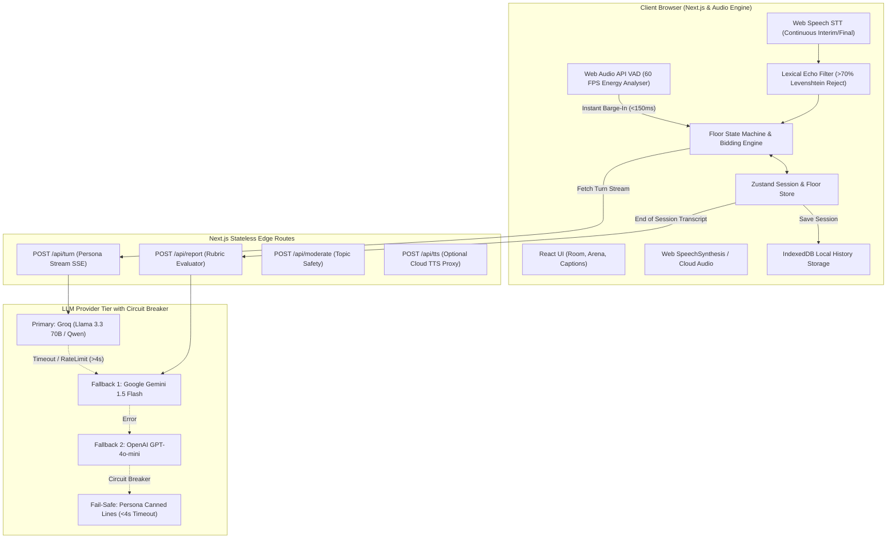

# 🎙️ PanelPrep (GD Arena)

> **Voice-First Multi-Agent AI Group Discussion Simulator for Campus Placements & High-Stakes Interviews**  
> *"Sit in a real GD boardroom anytime, debate with distinct AI personas, and get verifiable feedback that quotes exactly what you said."*

[](https://nextjs.org/)
[](https://www.typescriptlang.org/)
[](https://tailwindcss.com/)
[](https://github.com/pmndrs/zustand)
[](https://github.com/)

---

## 📌 Table of Contents

1. [Executive Summary & Problem Statement](#-executive-summary--problem-statement)
2. [Why Traditional AI & Chatbots Fail at GDs](#-why-traditional-ai--chatbots-fail-at-gds)
3. [Key Features](#-key-features)
4. [System Architecture & Data Flow](#-system-architecture--data-flow)
5. [The Core Turn-Taking & Floor Bidding Engine](#-the-core-turn-taking--floor-bidding-engine)
6. [Audio Engineering: STT, TTS & Instant Barge-In (<150ms)](#-audio-engineering-stt-tts--instant-barge-in-150ms)
7. [AI Persona Archetypes](#-ai-persona-archetypes)
8. [Zero-Hallucination Evidence Validation Engine](#-zero-hallucination-evidence-validation-engine)
9. [Tech Stack](#-tech-stack)
10. [Project Directory Structure](#-project-directory-structure)
11. [Getting Started & Installation](#-getting-started--installation)
12. [Environment Configuration](#-environment-configuration)
13. [CLI GD Simulator](#-cli-gd-simulator)
14. [Cost, Scalability & Performance Economics](#-cost-scalability--performance-economics)
15. [Product Roadmap](#-product-roadmap)

---

## 🚀 Executive Summary & Problem Statement

In university campus recruitment and management admissions, **Group Discussions (GDs) eliminate 60% to 70% of candidates** before technical interviews or HR rounds. Candidates rarely fail due to technical ignorance; they fail due to:
- **Floor Contention Paralysis:** Hesitating during brief 1-second silence windows.
- **Handling Aggressive Interruptions:** Freezing when a peer cuts them off.
- **Monologues vs. Synthesis:** Speaking too long without synthesizing or building on previous points.
- **Lack of Realistic Practice:** Mock GDs with peers require coordinating 6–8 people, a moderator, and suffer from unstructured, subjective feedback.

**PanelPrep (GD Arena)** solves this by creating an ultra-realistic, voice-first browser boardroom. Candidates practice against 3 to 5 distinct AI peer archetypes guided by a professional moderator, featuring instant `<150ms` barge-in, realistic turn-taking contention, and post-session diagnostic reports where every piece of advice is verified against exact transcript timestamps.

---

## ⚔️ Why Traditional AI & Chatbots Fail at GDs

| Dimension | Generic AI Voice Mode (e.g. ChatGPT / Pi) | PanelPrep Voice Engine |
| :--- | :--- | :--- |
| **Conversational Topology** | Strict 1-on-1 ping-pong dialogue. | **Multi-party dynamic boardroom (3–5 AI personas + 1 Moderator + Candidate).** |
| **Floor Contention & Turn Taking** | Passive; always waits for candidate to finish speaking. | **Stochastic urge-bidding engine; AIs debate each other and compete for floor time.** |
| **Barge-In Latency** | High (`>800ms`), server-dependent audio interruption. | **`<150ms` local client-side Voice Activity Detection (VAD) audio cutoff.** |
| **Speaker Archetypes** | Uniform, compliant assistant persona. | **Engineered behavioral archetypes: Dominator, Analyst, Quiet One, Drifter, Diplomat.** |
| **Scoring & Feedback** | Generic text praise (*"You spoke well about tech"*). | **Deterministic mathematical telemetry + 100% verified transcript segment quote AST validation.** |
| **Privacy & Cost** | Requires costly server GPU audio streams & accounts. | **$0.00 zero-cost voice architecture using browser APIs + local IndexedDB persistence.** |

---

## ✨ Key Features

- 🎙️ **Voice-First Interactive GD Arena:** Complete spoken discussion with live speech recognition, visual active-speaker highlights, and real-time captions.
- ⚡ **Instant Client-Side Barge-In (`<150ms`):** Candidate can interrupt any speaking AI at any point. Local Web Audio VAD instantly stops TTS playback and aborts in-flight token streams.
- 🧠 **Multi-Persona Behavioral Engine:** AI participants debate, agree, challenge, drift off-topic, cite data, or invite silent members based on mathematical bidding urge scores.
- 🛡️ **Anti-Hallucination Evaluation (Evidence Validator):** Post-session reports score 6 placement competencies and verify that every quoted strength or flaw exists verbatim in the session transcript.
- 📊 **Deterministic Telemetry Dashboard:** Tracks Words Per Minute (WPM), Talk Share %, Filler Word Density (`um`, `uh`, `basically`, `matlab`), and Interruption counts.
- ⏱️ **Adjustable Floor Patience:** Customizable silence tolerance (600ms – 2500ms) allowing shy first-timers to practice gently, or seasoned candidates to face rapid-fire placement pressures.
- 🔕 **Smart Voice Isolation & Lexical Echo Filter:** Dual-layer acoustic filtering prevents AI speaker audio from bleeding into the candidate's transcript.
- 💾 **Local-First Privacy (IndexedDB):** Session records, analytics, and transcripts are stored securely in the browser with zero cloud database lock-in.
- 🔄 **Resilient Multi-Provider LLM Fallback:** Instant failover across Groq, Gemini, and OpenAI with a 4-second circuit breaker and fallback canned persona phrases.

---

## 🏗️ System Architecture & Data Flow

PanelPrep uses a **Client-Side Orchestration & Stateless Edge API** paradigm. All turn-taking, floor arbitration, and barge-in logic runs directly in the client browser, while serverless API routes handle LLM streaming and evidence verification.



---

## 🎯 The Core Turn-Taking & Floor Bidding Engine

### Floor State Machine

Only **one entity** holds the floor token at any given millisecond. The state machine transitions across explicit states:

```
[SETUP] ➔ [MIC_CHECK] ➔ [PREP (20s)] ➔ [MODERATOR_OPENING] ➔ [LIVE_IDLE]
                                                                     │
              ┌──────────────────────────────────────────────────────┴──────────────────────┐
              ▼                                                                             ▼
   [STUDENT_SPEAKING] ◄────────────────── Instant Barge-In (<150ms) ─────────────── [AI_SPEAKING]
              │                                                                             ▲
              ▼                                                                             │
         [LIVE_IDLE] ──────── Silence > 1.8s (Highest Bidding Winner) ─────────────► [AI_THINKING]
              │
              ▼ (Timer Reaches Zero)
      [CLOSING_ROUND] ➔ [ENDED] ➔ [EVIDENCE_REPORT_GENERATION]
```

### Stochastic Bidding Algorithm

When the floor enters `LIVE_IDLE`, each AI participant $i$ calculates an urge score $B_i$:

$$B_i = \left( W_{\text{talk}} \times R \right) \times D_{\text{recency}} \times M_{\text{student}} + \epsilon$$

Where:
- **$W_{\text{talk}}$ (Talkativeness Baseline):** Persona trait weight (Arjun = 1.8, Kabir = 0.6, Meera = 1.2, Sana = 1.0, Rohan = 0.9).
- **$R$ (Random Jitter):** Uniform distribution $[0.8, 1.2]$ to eliminate predictable turn loops.
- **$D_{\text{recency}}$ (Recency Decay):** Exponential penalty ($0.15^{\text{turns\_ago}}$) if the persona spoke recently, preventing AI monopoly.
- **$M_{\text{student}}$ (Candidate Inclusion Spike):** If the candidate remains silent for $>45\text{s}$, Dr. Nair or Sana's bid surges ($2.5\times$) with an `invite_student` intent.
- **$\epsilon$ (Consecutive AI Dampener):** Capped at **2 consecutive AI turns**; AI bids drop by 60% after 2 turns to deliberately yield floor space for the student.

---

## 🔊 Audio Engineering: STT, TTS & Instant Barge-In (<150ms)

```
Candidate Speaks ──► AnalyserNode (RMS > 0.08) ──► 1. window.speechSynthesis.cancel() (~5ms)
                                                ──► 2. activeAbortController.abort() (LLM Stream Kills)
                                                ──► 3. Segment marked { interrupted: true }
                                                ──► Floor State: STUDENT_SPEAKING (<150ms total)
```

### Acoustic Isolation & Echo Cancellation
1. **Browser AEC Constraints:** Enables hardware `echoCancellation`, `noiseSuppression`, and `autoGainControl`.
2. **Lexical Echo Filter (`isEchoOfCurrentAiSpeech`):** If Web Speech STT transcribes speech while an AI is speaking, it compares the tokens using Levenshtein distance against `activeAiSentence`. If similarity exceeds $70\%$, the transcript is silently dropped as speaker acoustic bleed.

---

## 👥 AI Persona Archetypes

| Persona | Role | Trait & Behavior | Acoustic Voice Signature |
| :--- | :--- | :--- | :--- |
| **Dr. Nair** | **Moderator** | Structured, authoritative, time-conscious, redirects drifts, runs closing rounds. | Calm, balanced pitch, measured cadence. |
| **Arjun** | **The Dominator** | Aggressive, high-conviction, fast speaker, challenges peers, bids early. | Deeper pitch, accelerated rate (1.15x). |
| **Meera** | **The Analyst** | Framework-driven, quantitative, structures arguments into pros/cons. | Crisp, articulate, neutral pitch. |
| **Kabir** | **The Quiet One** | Speaks infrequently; delivers sharp, concise, high-impact counterpoints. | Soft, thoughtful, slightly slower rate (0.9x). |
| **Sana** | **The Drifter** | Lateral thinker, introduces unconventional examples, occasionally strays off-topic. | Higher pitch, energetic, dynamic cadence. |
| **Rohan** | **The Diplomat** | Bridges conflicting arguments, synthesizes consensus, plays devil's advocate. | Warm, steady, conversational tone. |

---

## 🔍 Zero-Hallucination Evidence Validation Engine

Post-GD feedback reports are divided into two strict layers:

### Layer 1: Deterministic Telemetry (100% Mathematical)
- **Speaking Pace (WPM):** $\frac{\text{Total Student Spoken Words}}{\text{Student Speaking Time (Minutes)}}$
- **Talk Share Percentage:** $\frac{\text{Student Speaking Milliseconds}}{\text{Total Session Milliseconds}} \times 100$
- **Filler Word Density:** Regex frequency analysis on `\b(um|uh|like|basically|matlab|toh|you know)\b`
- **Interruption Analytics:** Direct count of student barge-ins vs. peer cut-offs.

### Layer 2: AST Transcript Segment Verification
1. Every utterance in the conversation receives an immutable ID (e.g. `u_014`).
2. The evaluation LLM outputs structured JSON citing `segment_id` and `quote` for every feedback claim across 6 placement dimensions:
   - **Starting the Discussion**
   - **Quality of Ideas & Arguments**
   - **Building on Others & Synthesis**
   - **Active Listening**
   - **Handling Interruptions & Pressure**
   - **Closing Statement & Impact**
3. `evidenceValidator.ts` validates that every quoted string is an exact substring within the referenced segment ID. **Fabricated or altered quotes are automatically stripped from the report.**

---

## 💻 Tech Stack

- **Core Framework:** [Next.js 14](https://nextjs.org/) (App Router, Server Actions & Edge API Handlers)
- **Language:** [TypeScript 5.6](https://www.typescriptlang.org/) (Strict Mode)
- **Styling & UI:** [Tailwind CSS 3.4](https://tailwindcss.com/), [Lucide React Icons](https://lucide.dev/), Glassmorphism design tokens
- **State Orchestration:** [Zustand 4.5](https://github.com/pmndrs/zustand) (Finite Floor State Machine & active session state)
- **Local Database:** [IndexedDB via `idb` 8.0](https://github.com/jakearchibald/idb) (Client-side offline session history)
- **Validation & Schemas:** [Zod 3.23](https://zod.dev/) (Strict LLM output & API payload verification)
- **Speech Pipeline:** 
  - *STT:* Web Speech API (`SpeechRecognition`) with continuous interim stream.
  - *VAD:* Web Audio API `AudioContext` & `AnalyserNode` for real-time RMS energy measurement.
  - *TTS Tier A:* Native Browser `window.speechSynthesis`.
  - *TTS Tier B (Optional):* Cloud ElevenLabs / Cartesia proxy routes.
- **LLM Engine:** Groq SDK (`llama-3.3-70b-versatile`, `qwen`), Google GenAI (`gemini-1.5-flash`, `gemini-1.5-pro`), OpenAI SDK (`gpt-4o-mini`).

---

## 📁 Project Directory Structure

```
PanelPrep/
├── .env.example                        # Environment variables template
├── package.json                        # Scripts & dependencies
├── tsconfig.json                       # TypeScript compiler settings
├── tailwind.config.ts                  # Theme tokens & keyframe animations
├── next.config.mjs                     # Next.js build & edge headers
├── public/                             # Public static assets & favicon
├── scripts/
│   └── simulate-gd.ts                  # Headless terminal GD simulation runner
└── src/
    ├── app/
    │   ├── layout.tsx                  # Root layout & global metadata
    │   ├── page.tsx                    # Landing page & wizard setup
    │   ├── globals.css                 # Custom utility styles & animations
    │   ├── room/page.tsx               # Live Spoken GD Arena (Floor UI, Timer, Captions)
    │   ├── report/page.tsx             # Diagnostic Analytics & Evidence Report
    │   ├── history/page.tsx            # Local session archive & progress tracking
    │   ├── dashboard/                  # Candidate performance analytics dashboard
    │   │   ├── page.tsx                # Aggregate stats & competency growth
    │   │   ├── personas/page.tsx       # AI persona roster & acoustic settings
    │   │   └── settings/               # Audio, mic, and API configuration
    │   └── api/
    │       ├── turn/route.ts           # SSE streaming persona turn generation
    │       ├── report/route.ts         # Post-session rubric & evidence verification
    │       ├── moderate/route.ts       # Custom topic content safety gate
    │       └── tts/route.ts            # Optional Tier-B Cloud TTS proxy
    ├── components/
    │   ├── common/                     # Header, Footer, Badge, Button, Modal
    │   ├── setup/                      # TopicSelector, PanelSelector, PatienceSlider, MicCheckModal
    │   ├── room/                       # ParticipantCard, LiveCaptions, RoomControls, Timer
    │   ├── report/                     # DimensionCard, EvidenceQuote, StatCard, MissedOpenings
    │   └── dashboard/                  # ProgressCharts, PerformanceMetrics, HistoryList
    └── lib/
        ├── ai/
        │   ├── llmClient.ts            # Multi-provider LLM caller with circuit breaker
        │   ├── prompts.ts              # Persona system prompts & structured schemas
        │   ├── evidenceValidator.ts    # Exact AST transcript quote verification
        │   └── statsCalculator.ts      # Deterministic math telemetry engine
        ├── orchestrator/
        │   ├── floorStateMachine.ts    # Centralized floor state reducer
        │   ├── biddingEngine.ts        # Dynamic urge scoring & speaker selection
        │   ├── timerManager.ts         # Phase timers (Prep, Opening, Free, Closing)
        │   └── turnIntent.ts           # Heuristic turn intent selector
        ├── speech/
        │   ├── vadDetector.ts          # Web Audio API RMS energy monitor
        │   ├── sttService.ts           # Web Speech API wrapper with auto-restart
        │   ├── ttsService.ts           # Browser SpeechSynthesis manager
        │   └── echoFilter.ts           # Levenshtein acoustic bleed rejector
        ├── storage/
        │   └── indexedDb.ts            # Client-side IndexedDB session CRUD
        ├── constants/                  # Personas, rubrics, default topics
        └── types/                      # TypeScript schemas for Arena, API, Reports
```

---

## 🛠️ Getting Started & Installation

### Prerequisites
- **Node.js**: v18.17.0 or higher
- **npm** or **pnpm** / **yarn**
- **Browser**: Google Chrome, Microsoft Edge, or Chromium-based browser (for Web Speech API support)

### 1. Clone the Repository
```bash
git clone https://github.com/astikverma25/PanelPrep.git
cd PanelPrep
```

### 2. Install Dependencies
```bash
npm install
```

### 3. Configure Environment Variables
Copy the example configuration file:
```bash
cp .env.example .env.local
```
Add your preferred API key (Groq, Gemini, or OpenAI) in `.env.local`:
```env
LLM_PRIMARY_PROVIDER=groq
GROQ_API_KEY=gsk_your_groq_api_key_here
GROQ_MODEL=llama-3.3-70b-versatile

LLM_FALLBACK_PROVIDER=gemini
GEMINI_API_KEY=AIzaSy_your_gemini_api_key_here
GEMINI_MODEL=gemini-1.5-flash
```

### 4. Run the Development Server
```bash
npm run dev
```
Open [http://localhost:3000](http://localhost:3000) in Google Chrome or Edge to launch the arena.

---

## ⚙️ Environment Configuration

| Variable | Required | Default | Description |
| :--- | :---: | :--- | :--- |
| `LLM_PRIMARY_PROVIDER` | Yes | `groq` | Primary LLM provider (`groq`, `gemini`, `openai`). |
| `GROQ_API_KEY` | Conditional | — | API key for Groq ultra-low latency streaming. |
| `GROQ_MODEL` | No | `llama-3.3-70b-versatile` | Model name for Groq turns. |
| `LLM_FALLBACK_PROVIDER` | Yes | `gemini` | Automatic fallback provider if primary times out (>4s). |
| `GEMINI_API_KEY` | Conditional | — | API key for Google Gemini. |
| `GEMINI_MODEL` | No | `gemini-1.5-flash` | Model for fallback turn generation. |
| `REPORT_LLM_PROVIDER` | No | `gemini` | Provider used for comprehensive post-session evaluation. |
| `REPORT_LLM_MODEL` | No | `gemini-1.5-pro` | Model for deep rubric analysis & quote extraction. |
| `TTS_PROVIDER` | No | `browser` | `browser` (Tier A, free, 0ms) or `elevenlabs`/`cartesia` (Tier B). |
| `RATE_LIMIT_MAX_REQUESTS`| No | `60` | Max requests per minute per IP. |

---

## 🧪 CLI GD Simulator

PanelPrep includes a headless Node/TypeScript simulation script to test LLM persona debates and rubric evaluation without needing microphone input:

```bash
npm run simulate
```

This runs a 6-turn automated discussion between Arjun, Meera, and Dr. Nair, outputs live terminal dialogue, computes deterministic telemetry, and generates a validated evidence report.

---

## 💰 Cost, Scalability & Performance Economics

| Dimension | Metric | Engineering Detail |
| :--- | :--- | :--- |
| **STT Latency & Cost** | `0ms` network / **$0.00** | Browser Web Speech API with local processing. |
| **TTS Latency & Cost** | `0ms` network / **$0.00** | Browser SpeechSynthesis with custom pitch/rate audio signatures. |
| **Barge-In Latency** | **`<150ms`** | Local Web Audio Analyser RMS threshold detection. |
| **LLM Time-to-First-Token** | **`~300ms`** | High-throughput streaming via Groq Llama 3.3. |
| **Total Turn Latency (p50)** | **`1.8s`** | End of student silence to first synthesized AI sound. |
| **Total Session Cost** | **`~$0.0014`** | Less than 1/5th of a US cent per full 5-minute placement GD round. |

---

## 🗺️ Product Roadmap

- [x] Multi-Persona Floor State Machine & Stochastic Urge Bidding Engine
- [x] Client-Side Web Audio API RMS Voice Activity Detection (<150ms Barge-in)
- [x] Zero-Hallucination AST Evidence Matcher for 6 Rubric Dimensions
- [x] Browser IndexedDB History, WPM Telemetry & Performance Dashboard
- [x] Multi-Provider Fallback (Groq ➔ Gemini ➔ OpenAI ➔ Canned Lines)
- [ ] Multi-User Peer Mode (WebRTC/LiveKit room sharing with AI co-moderator)
- [ ] Hinglish / Vernacular Accent Adaptation for regional campus placement drives
- [ ] Video & Non-Verbal Eye-Contact / Posture Detection via MediaPipe

---

## 📜 License & Acknowledgements

Developed with ❤️ for students preparing for campus placements and competitive group interviews.  
Distributed under the **MIT License**.
